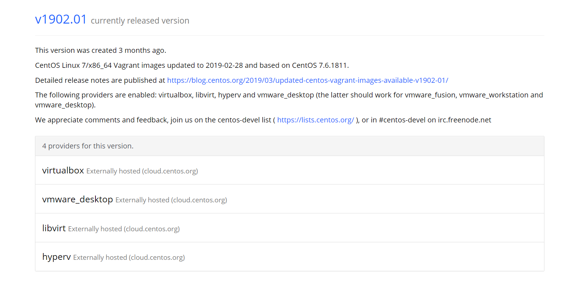
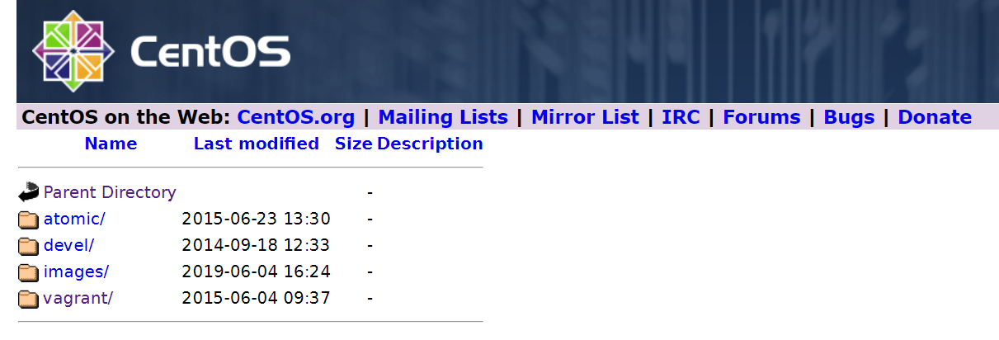
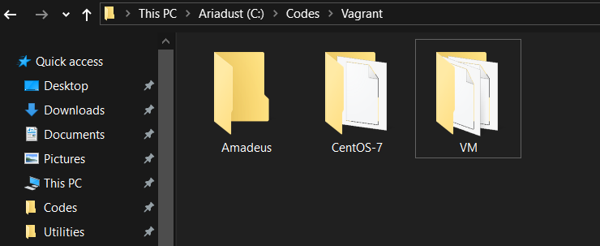

# Basic Vagrant Initialization (with VirtualBox in Windows)

## Installation

The official sites of Vagrant is [here](https://www.vagrantup.com/downloads.html) and VirtualBox's is [here](https://www.virtualbox.org/wiki/Downloads).
Following their default option to install is rather practical. After
the installation is complete, make sure the Environment variables 
contains vagrant.exe's path. To assure this, You may be asked to 
restart your PC.

## Get Box Preparation Ready

Choose a folder to place your vagrant box, that is, the virtual machine.
By the way, Vagrant provides commands to init and install box simultaneously 
like

```cmd
$ vagrant init hashicorp/precise64
```

But I suggest to download a box file manually from this [site](https://app.vagrantup.com/boxes/search), find
the distro you want and go to host to download directly via tools like
Free Download Manager, etc. Place it in a nearby directory beside your
vagrant box directory chosen before.

For example, I choose CentOS 7 and go to the description page and it goes
like this



then go to VirtualBox Externally hosted site, as demonstrated below



and click and click, find the latest version, use those downloading
tools to get them. Guess what, the hosted images are sometimes further
newer than those listed on the Vagrant Cloud page.

Here, I placed the box downloaded before in `VM` directory and chose the
`Amadeus` directory to store those virtual machine configuration files.



## Initialization Commands

Open a terminal in `Amadeus` directory, and type command

```cmd
vagrant box add BOXNAME BOXPATH
```

for instance, the output shall be like messages below

```cmd
C:\Codes\Vagrant\Amadeus>vagrant box add Amadeus ..\VM\CentOS-7-x86_64-Vagrant-1905_01.VirtualBox.box
==> box: Box file was not detected as metadata. Adding it directly...
==> box: Adding box 'Amadeus' (v0) for provider:
    box: Unpacking necessary files from: file://C:/Codes/Vagrant/VM/CentOS-7-x86_64-Vagrant-1905_01.VirtualBox.box
    box: Progress: 100% (Rate: 244M/s, Estimated time remaining: --:--:--)
==> box: Successfully added box 'Amadeus' (v0) for 'virtualbox'!
```

Then, type `vagrant init`, the output is

```cmd
C:\Codes\Vagrant\Amadeus>vagrant init
A `Vagrantfile` has been placed in this directory. You are now
ready to `vagrant up` your first virtual environment! Please read
the comments in the Vagrantfile as well as documentation on
`vagrantup.com` for more information on using Vagrant.
```

## How to Edit the Vagrantfile

The `Vagrantfile` generated defines the behavior of the virtual machine,
from host name to network settings, and it is written in Ruby, so please
make sure the `end`s are closed properly after your editing.

Let's fire up **vim** and edit it. The comments are pretty detailed, but there
are more customization options.

### Naming

Choose a fancy hostname and box name by adding these lines

```Ruby
config.vm.box = "Amadeus"    # box added before
config.vm.hostname = "Rome"
config.vm.define "Amadeus"   # Pay Attention to THIS line
```

And between `config.vm.provider "virtualbox" do |vb|` and its paired `end`
add these lines. Anf if you want to customize the memory and cpu usages
allocated to the box, you can define them here.  

```Ruby
vb.gui = false
vb.name = "Amadeus"
vb.memory = "2048"
vb.cpus = 2
```


### Network

`guest` in this scenario refers to the Vagrant virtual machine, while
`host` means your Windows.

```Ruby
config.vm.network "forwarded_port", guest: 80, host: 8080
config.vm.network "forwarded_port", guest: 5000, host: 5050

config.vm.network "private_network", ip: "192.168.22.22"
```

### Shared Folder

Or `synced folder`, according to Vagrantfile. The former one is host's
directory, the latter is virtual machine's. 

```Ruby
config.vm.synced_folder "C:/Codes/Projects", "/home/projects"
```

### Finally...

The whole Vagrantfile goes like below

```Ruby
Vagrant.configure("2") do |config|
  config.vm.box = "Amadeus"
  config.vm.hostname = "Rome"
  config.vm.define "Amadeus"

  config.vm.network "forwarded_port", guest: 80, host: 8080
  config.vm.network "forwarded_port", guest: 5000, host: 5050

  config.vm.network "private_network", ip: "192.168.22.22"

  config.vm.synced_folder "C:/Codes/Projects", "/home/projects"

  config.vm.provider "virtualbox" do |vb|
    vb.gui = false
    vb.name = "Amadeus"
    vb.memory = "2048"
    vb.cpus = 2
  end
end
```

Before `vagrant up`, you should install plugin vbguest

```cmd
C:\Codes\Vagrant\Amadeus>vagrant plugin install vagrant-vbguest
```

The outputs are below, give the permission when the prompting window
pops up.

```cmd
Installing the 'vagrant-vbguest' plugin. This can take a few minutes...
Fetching: micromachine-2.0.0.gem (100%)
Fetching: vagrant-vbguest-0.18.0.gem (100%)
Installed the plugin 'vagrant-vbguest (0.18.0)'!
```

Then type `vagrant up`, notice there might be a kernel compilation
process for kernel. After that, everything shall be fine.

Use `vagrant ssh` to access the virtual machine under the `Amadeus`
directory.

To shutdown the virtual machine, use `vagrant halt`.