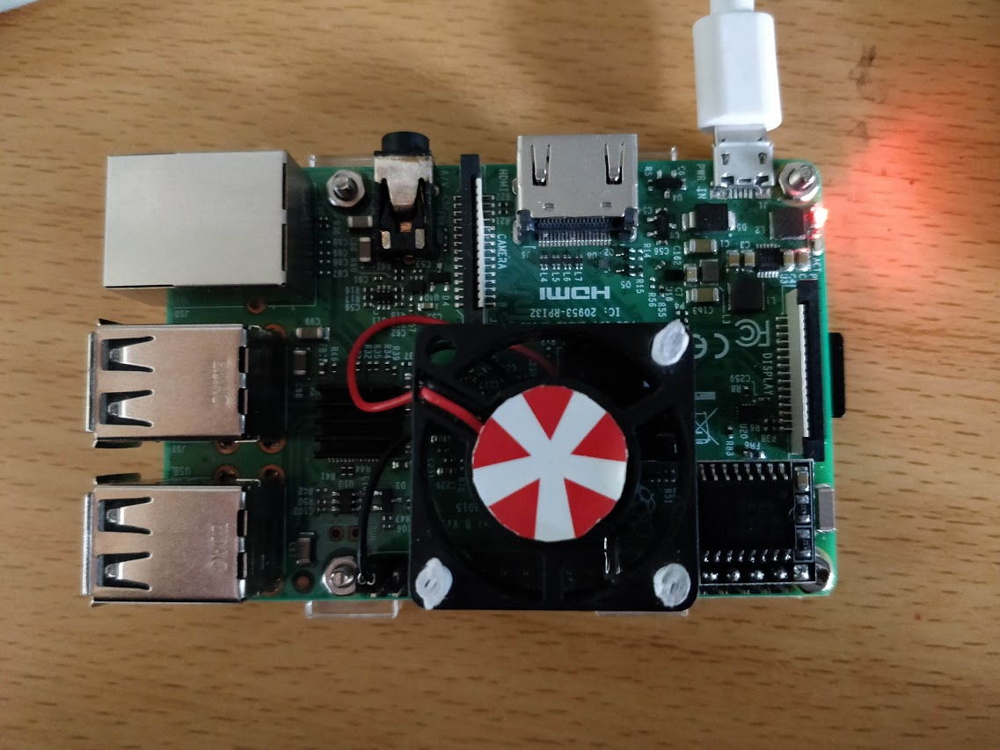
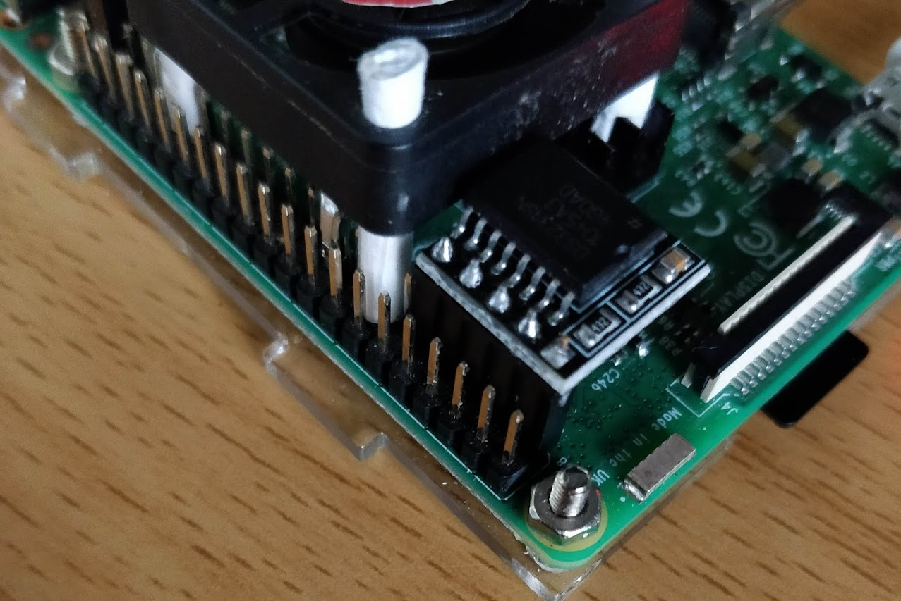
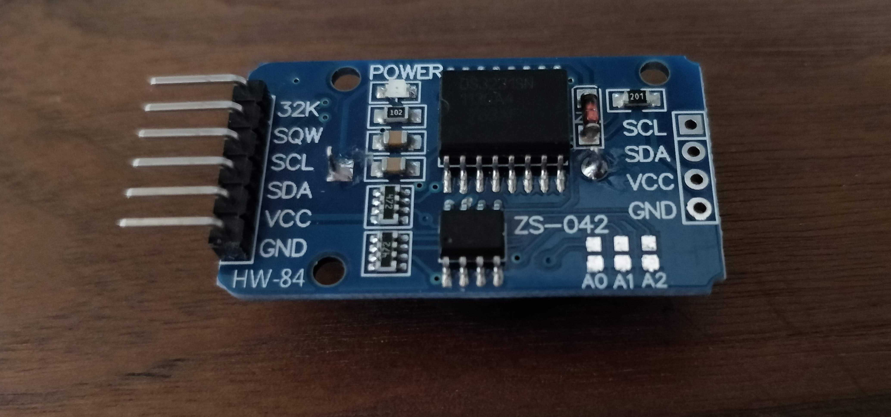

# Install CentOS to Raspberry Pi 3 Model B



## Before you start

* This file is based on
  * Windows 10
  * Your own WiFi
  * An Ethenet cable
* Why CentOS? Because on April 3rd 2019 Jack encountered a bizarre bug on Raspbian. After installing php 7.2, he rebooted it and he could never connect it via ssh by neither WiFI nor Ethenet cable...
* Damn it!
* **And the Official wiki is [here](https://wiki.centos.org/SpecialInterestGroup/AltArch/armhfp)**

## 1. Download the image

1. Find the edition you want [here](http://isoredirect.centos.org/altarch/7/isos/armhfp).
2. Download it and use 7z to deal with it. Just rename the .raw to .img, it works! Now write it into SD card via [Image Writer](https://sourceforge.net/projects/win32diskimager/).
3. Before inserting it into Pi, create an empty file named **ssh** and paste it into boot partition to enable ssh connection. Just ssh, no file extension affix.

## 2. Boot it, connect it, and expand it

1. Find an Ethenet cable and connect the pi to PC.
2. Enable network sharing in Settings.
3. Open some cmd software and type `arp -a`.
4. Find the IP address corresponding to Pi's MAC.
5. Start a ssh session, use `root@xxx.xxx.xxx.xxx` and the password is `centos`.
6. `less README`, follow its advice, so just type `rootfs-expand`. Very user-friendly, isn't it?
7. By the way, it's not a good idea to use root to log in, so I suggest reading [this file](../CentOSServer/secure_server.md) to add another user that has sudo privilege.

## 3. Welcome to 1969, WiFi

1. It seems that the newest version of ARM CentOS has resolved WiFi firmware distribution dilemma, so just type `systemctl start network.service` and, hola, WiFi is now enabled.
2. Type `nmcli d` and wlan0 is here.
3. Now type `nmtui` and choose `Activate a connection`, it's very easy to join the WiFi.
4. Type `date`, damn it.

## 4. Add a Real Time Clock to Raspberry Pi

DS3231 is a good choice:



Or you could choose this kind of DS3231:



And connect

* `VCC` to `3V3(Power)`,
* `GND` to `Ground`,
* `SDA` to `GPIO2(SDA1 I2C)`
* `SCL` to `GPIO3(SCL1 I2C)`


Connect Pi via ssh, enter `sudo yum install i2ctools -y` to install i2ctools. Then enter `sudo vim /boot/config.txt`, add these two lines to enable i2c

```config
dtparam=i2c_arm=on
dtoverlay=i2c-rtc, ds3231
```

Enter `lsmod | grep i2c`, and the output should be like this:

```output
i2c_bcm2835     16384   0
i2c_dev         16384   0
```

Use `sudo vim /etc/modules-load.d/i2c.conf` to append the following lines to the `i2c.conf`:

```conf
i2c-dev
i2c-bcm2835
```

now use `sudo reboot` to reboot the Pi.

Access it again via ssh or some other tools, type `sudo i2cdetect -y 1`, the output should be like this:

```output
     0  1  2  3  4  5  6  7  8  9  a  b  c  d  e  f
00:          -- -- -- -- -- -- -- -- -- -- -- -- --
10: -- -- -- -- -- -- -- -- -- -- -- -- -- -- -- --
20: -- -- -- -- -- -- -- -- -- -- -- -- -- -- -- --
30: -- -- -- -- -- -- -- -- -- -- -- -- -- -- -- --
40: -- -- -- -- -- -- -- -- -- -- -- -- -- -- -- --
50: -- -- -- -- -- -- -- -- -- -- -- -- -- -- -- --
60: -- -- -- -- -- -- -- -- UU -- -- -- -- -- -- --
70: -- -- -- -- -- -- -- --
```

It works! Let's set the system time, for example:

```cmd
sudo date -s 2019-4-10
sudo date -s 14:56:24
```

then type `sudo hwclock -w` to write system time and date into DS3231.

Next, enter `sudo vim /etc/rc.local` to add time sync to startup tasks, add

```rc.local
echo ds3231 0x68 > /sys/class/i2c-adapter/new_device
hwclock -s
```

At last, run `sudo chmod +x /etc/rc.d/rc.local` to ensure the script will be executed during boot as it suggests. Now reboot and give `date` a try.

## 5. A little server

If you browse the package [list](http://mirror.centos.org/altarch/7/os/armhfp/Packages/) of CentOS-altarch-armhfp, and there is no php 7 available. But I found a solution [here](https://seven.centos.org/2018/01/php-7-2-for-centos-7-armhfp/)

```cmd
cat > /etc/yum.repos.d/epel.repo << EOF
[epel]
name=Epel rebuild for armhfp
baseurl=https://armv7.dev.centos.org/repodir/epel-pass-1/
enabled=1
gpgcheck=0
EOF
```

then

```cmd
cat > /etc/yum.repos.d/php72-testing.repo << EOF
[php72-testing]
name=Remi php72 rebuild for armhfp
baseurl=https://armv7.dev.centos.org/repodir/community-php72-testing/
enabled=1
gpgcheck=0
EOF
```

finally

```cmd
cat > /etc/yum.repos.d/remi.repo << EOF
[remi]
name=Remi's RPM repository for Enterprise Linux 7 - $basearch
mirrorlist=http://cdn.remirepo.net/enterprise/7/remi/mirror
enabled=1
gpgcheck=1
gpgkey=https://rpms.remirepo.net/RPM-GPG-KEY-remi
EOF
```

Hola! The rest is easy.