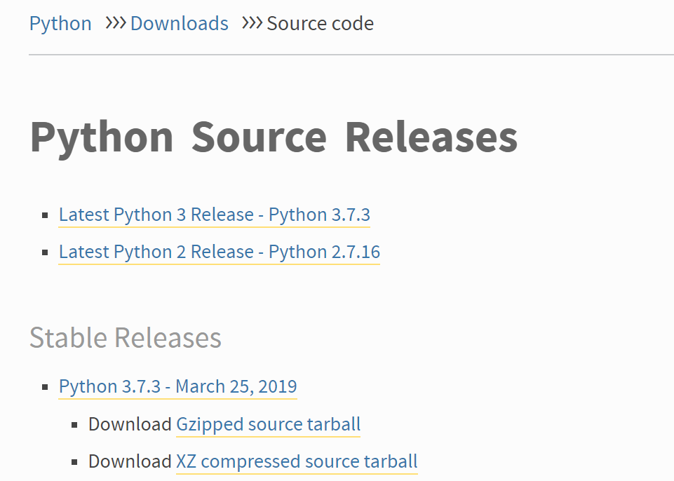

# Python Manual Installation

## Prerequisites


* *DEVELOPMENT TOOLS & BUILD-ESSENTIAL INTENSIFIES*
* *WGET*

Debian
```cmd
$ sudo apt install build-essential
```
Fedora/CentOS
```cmd
$ sudo dnf/yum groupinstall "Development Tools"
```

## Download and Unzip

Click the Gzipped source tarball to download,



then locate to `/usr/src`, run

```cmd
$ sudo wget https://www.python.org/ftp/python/3.7.3/Python-3.7.3.tgz
$ sudo tar xzf Python-3.7.3.tgz
```

## Compile

Go to the directory you get from last step

```cmd
$ cd Python-3.7.3
$ sudo ./configure --enable-optimization
$ sudo make altinstall
$ sudo rm ../Python-3.7.3.tgz
```

## Check

```cmd
$ python3.7 --version
```

If the output is

```cmd
Python 3.7.3
```


## Python Virtual Environment

First, install...

```cmd
$ python3.7 -m pip --user install virtualenv
```

>Slow downloading speed? Try to find some other PyPi mirror!

Locate to the project directory, run

```cmd
$ python3.7 -m venv path/to/venv_name
```
**<pre>-- ATTENTION HERE VAGRANT WINDOWS USERS --</pre>**
<pre>
If you are working on Vagrant shared folder, you may encounter a
protocol error when trying to run the command above. To resolve this
error, use `rm -r path/to/venv_name` to delete the environment you
created before, exit ssh and `vagrant halt`.

Then launch a cmd or other alike tools granted with admin privilege,
locate to the vagrant instance folder and `vagrant up`, re-run that
env-creating command above. Now everything shall works fine.
</pre>
**<pre>-- ATTENTION HERE VAGRANT WINDOWS USERS --</pre>**

To activate the virtual environment, type

```cmd
$ source env_name/bin/activate
```

now in front of the `$` is a pair of parentheses contains your env
name you set before.

If you want to leave, simply run `deactivate`.

### Have fun coding!